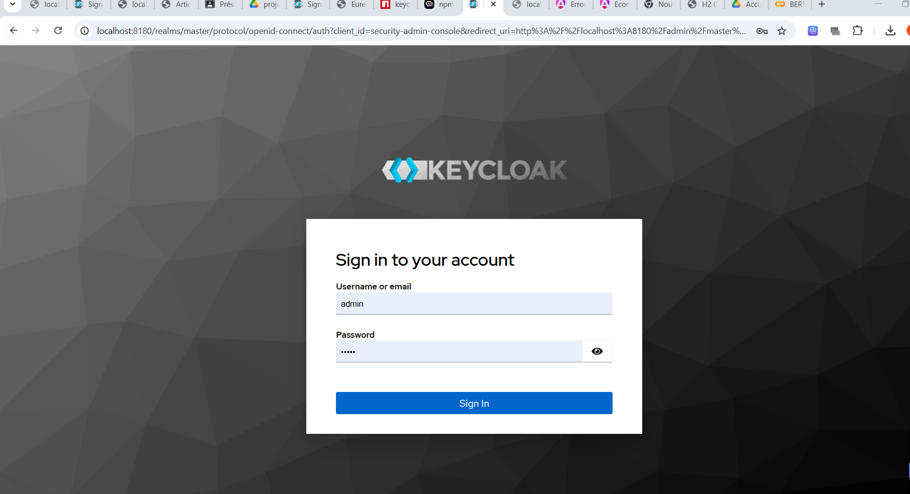
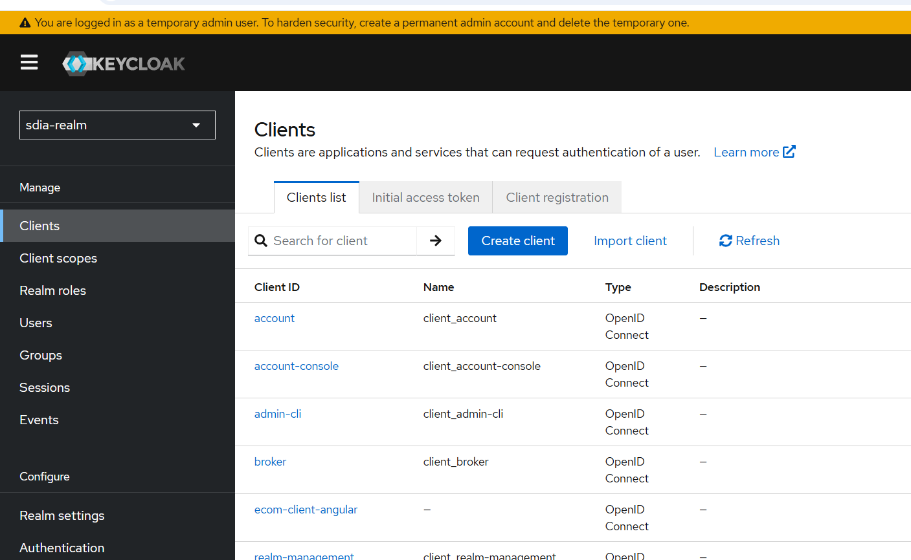
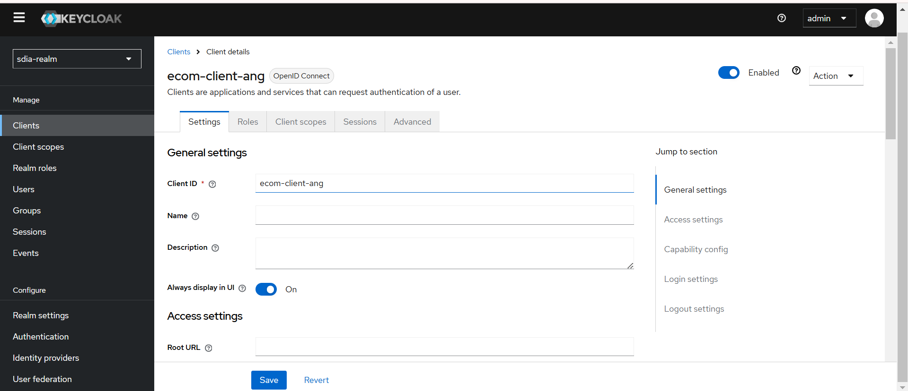
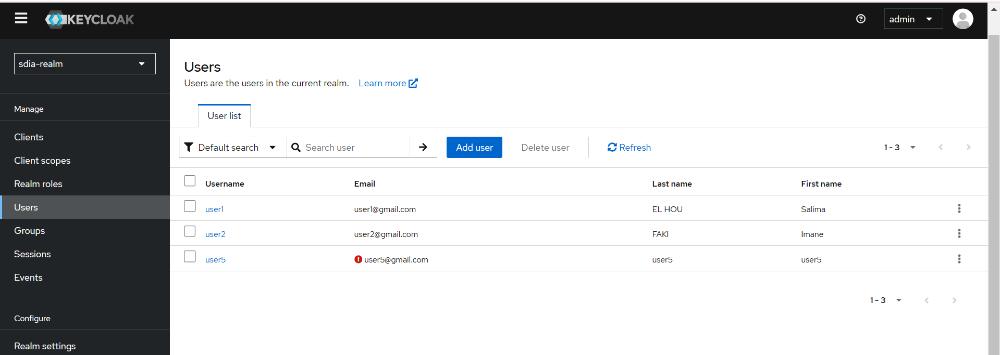
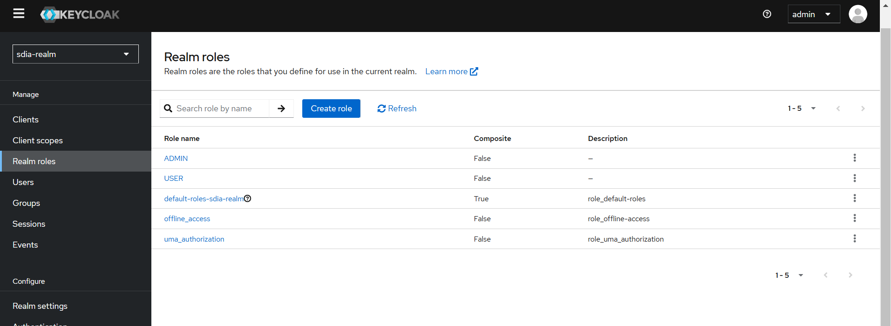
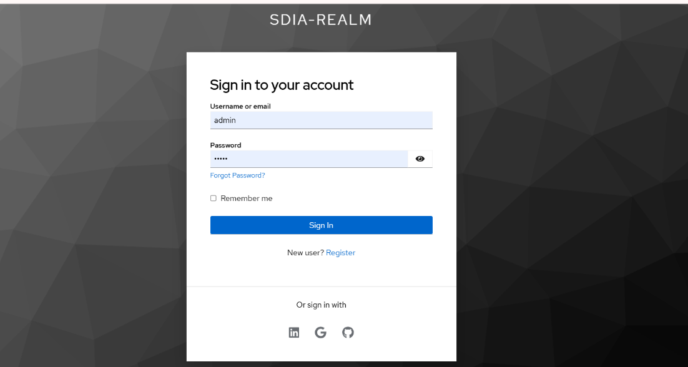
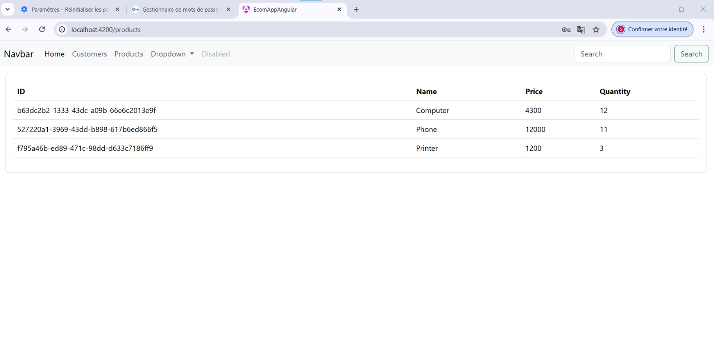
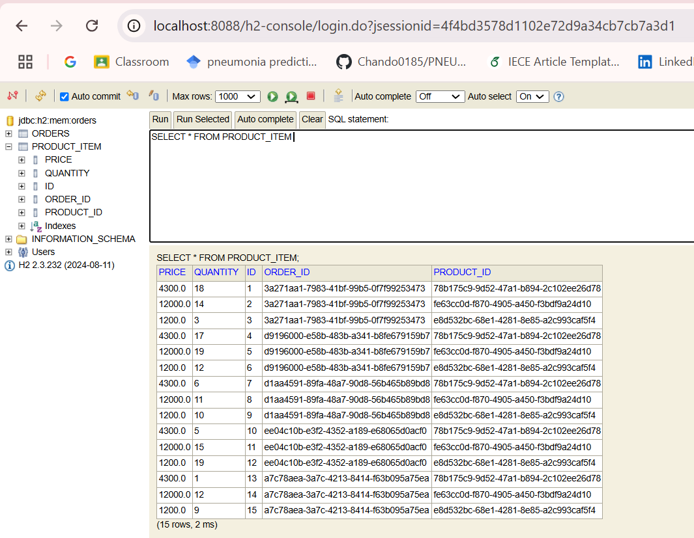
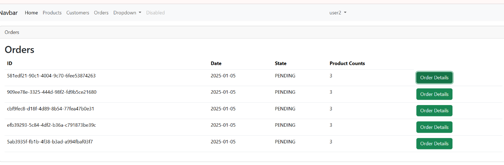
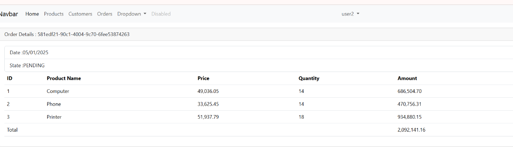

# Salma EZACCANI master SDIA 2

#  Sécurité des systèmes distribués Oauth2 OIDC Keycloak

## Partie 1 : Configuration de Keycloak

### Étapes pour configurer Keycloak :

**Démarrer Keycloak**
    - Commande pour démarrer Keycloak 
      ```bash
       docker run -p 8080:8080 -e KC_BOOTSTRAP_ADMIN_USERNAME=admin -e KC_BOOTSTRAP_ADMIN_PASSWORD=admin quay.io/keycloak/keycloak:26.0.7 start-dev
      ```


**Accédez à http://localhost:8080**
    -

**Créer une Realm realm-sdia**
 
      

**Créer un client ecom-client-ang**



**Créer des utilisateurs**



** Affectez ces rôles aux utilisateurs.**
    - Exemple de rôles : `ADMIN`, `USER`.
   

---

## Exécution des tests avec Postman

### Tester l'authentification avec les JWT


---

## Partie 2 : Développement et sécurisation de l'architecture Micro-Service

    - Configurez un serveur Spring Boot avec sécurité Keycloak.
   

2. **Frontend : Angular**
    - Implémentez l'authentification via Keycloak dans Angular.
    - Utilisez la bibliothèque **keycloak-js** pour intégrer Keycloak.






**Orders :**
**H2 Database :**



**Orders interface :**



**Order Details :**



